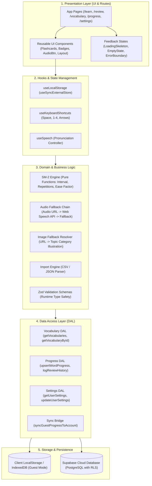
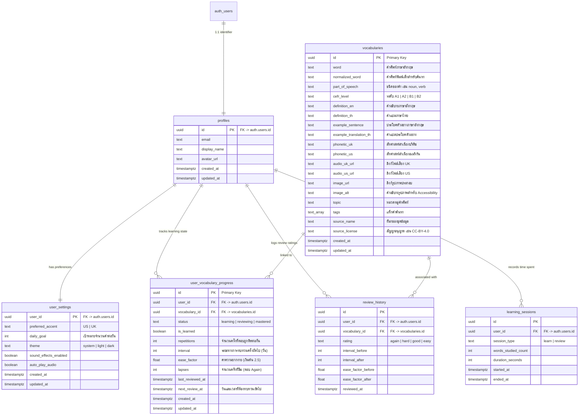
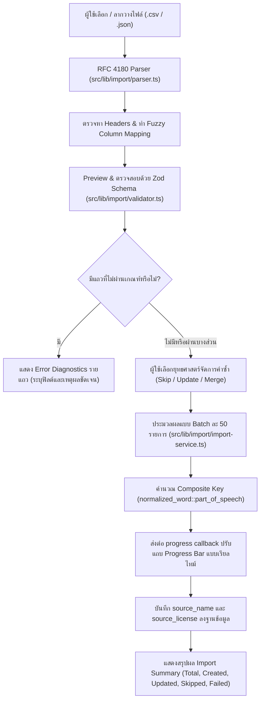
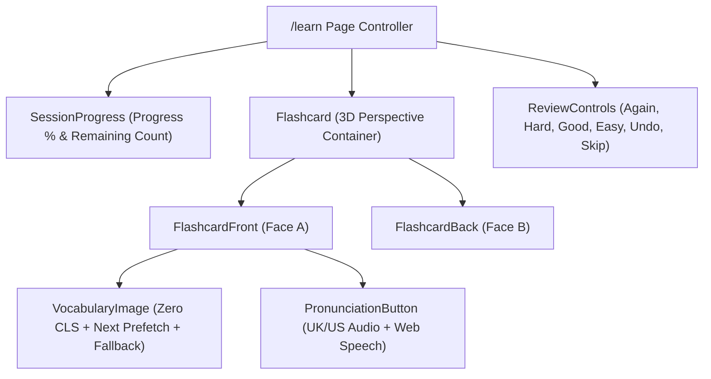
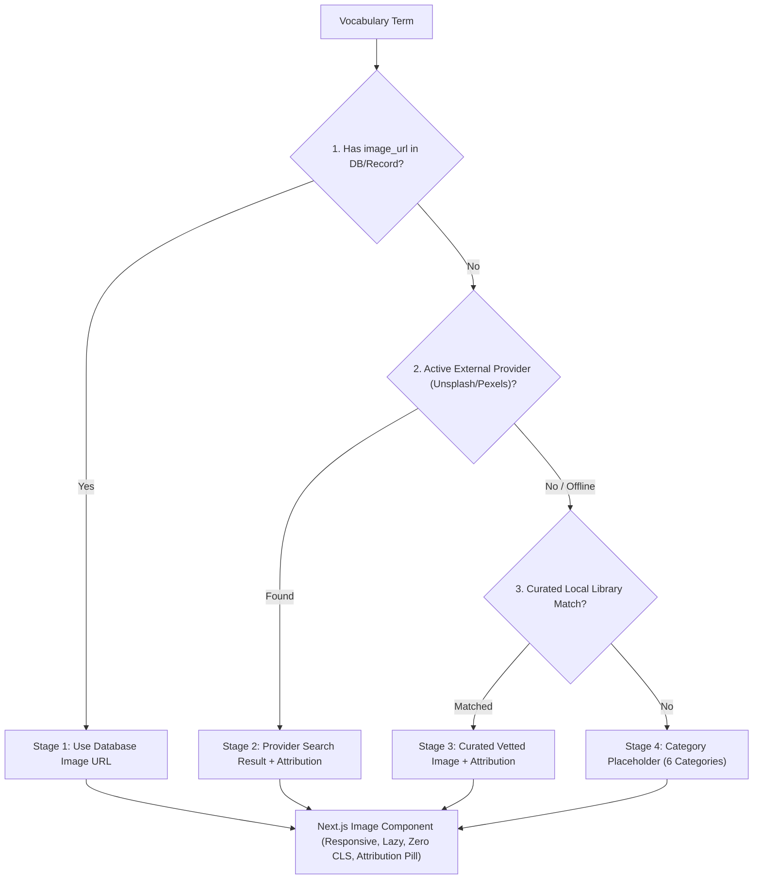

# 🏛️ สถาปัตยกรรมระบบ VocabFlow (System Architecture)

> **เอกสารนี้จัดทำขึ้นเพื่อให้เห็นภาพรวมเชิงโครงสร้าง สถาปัตยกรรม และการไหลของข้อมูลทั้งหมดในโปรเจกต์**  
> *สถานะ: อัปเดตล่าสุดครอบคลุม Prompt 1 (โครงโปรเจกต์ & UI), Prompt 2 (การออกแบบฐานข้อมูล & Supabase), Prompt 3 (ระบบนำเข้าคำศัพท์แอดมิน), และ Prompt 4 (ระบบ Flashcard & หน้า /learn)*

---

## 📑 สารบัญ
1. [ภาพรวมระบบและหลักการออกแบบ (Design Principles)](#1-ภาพรวมระบบและหลักการออกแบบ-design-principles)
2. [เทคโนโลยีที่ใช้ (Tech Stack & Rationale)](#2-เทคโนโลยีที่ใช้-tech-stack--rationale)
3. [แผนผังสถาปัตยกรรมแบบแบ่งเลเยอร์ (Layered Architecture)](#3-แผนผังสถาปัตยกรรมแบบแบ่งเลเยอร์-layered-architecture)
4. [โครงสร้างไดเรกทอรี (Directory Structure)](#4-โครงสร้างไดเรกทอรี-directory-structure)
5. [การออกแบบฐานข้อมูลและความปลอดภัย (Database & Security)](#5-การออกแบบฐานข้อมูลและความปลอดภัย-database--security)
6. [ระบบย่อยสำคัญและการไหลของข้อมูล (Core Subsystems & Data Flow)](#6-ระบบย่อยสำคัญและการไหลของข้อมูล-core-subsystems--data-flow)
7. [ระบบนำเข้าคำศัพท์ขั้นสูง (Admin Batch Vocabulary Importer)](#7-ระบบนำเข้าคำศัพท์ขั้นสูง-admin-batch-vocabulary-importer)
8. [สถาปัตยกรรม Flashcard และระบบเรียนรู้เชิงโต้ตอบ (Interactive Flashcard System)](#8-สถาปัตยกรรม-flashcard-และระบบเรียนรู้เชิงโต้ตอบ-interactive-flashcard-system)
9. [ข้อตกลงในการดูแลและอัปเดตสถาปัตยกรรม (Maintenance Protocol)](#9-ข้อตกลงในการดูแลและอัปเดตสถาปัตยกรรม-maintenance-protocol)

---

## 1. ภาพรวมระบบและหลักการออกแบบ (Design Principles)

VocabFlow ถูกออกแบบขึ้นมาภายใต้หลักการ 4 ประการสำคัญ:

```
┌─────────────────────────────────────────────────────────────────────────────┐
│                             VOCABFLOW PRINCIPLES                            │
├───────────────────┬───────────────────┬───────────────────┬─────────────────┤
│   Mobile First    │   Offline First   │  Clean Separation │ Strict Security │
│   & Ergonomics    │   & Local Cache   │   (UI / Domain)   │     & RLS       │
└───────────────────┴───────────────────┴───────────────────┴─────────────────┘
```

1. **Mobile-First & Ergonomics**: ออกแบบโดยให้ความสำคัญกับหน้าจอมือถือเป็นอันดับแรก ปุ่มกดขนาดพอดีนิ้วโป้ง มี Bottom Navigation Bar สำหรับมือถือ และ Top Header สำหรับหน้าจอคอมพิวเตอร์ รองรับ Gesture สัมผัสและการควบคุมด้วยคีย์บอร์ดครบถ้วน
2. **Offline-First (Guest Mode by Default)**: ผู้ใช้สามารถเริ่มเรียน ทบทวน บันทึกคำศัพท์ และดูสถิติได้ทันทีโดยไม่ต้องสมัครสมาชิก (บันทึกข้อมูลผ่าน `localStorage` ด้วย React 19 `useSyncExternalStore`) และเมื่อผู้ใช้ล็อกอิน ระบบจะมีสะพานเชื่อม Sync ข้อมูลเข้าสู่ฐานข้อมูลคลาวด์อัตโนมัติ
3. **Clean Separation of Concerns**: แยกความรับผิดชอบของโค้ดชัดเจน:
   - **Presentation Layer (UI)**: แสดงผล รับการกดปุ่ม (React Components)
   - **Domain / Feature Logic**: ตรรกะทางธุรกิจ เช่น การคำนวณ SM-2, การตรวจสอบ Zod, ตัวแปลง CSV/JSON
   - **Data Access Layer (DAL)**: ติดต่อฐานข้อมูลหรือพื้นที่จัดเก็บ (Supabase / LocalStorage)
4. **Strict Security & Copyright Integrity**:
   - เปิดใช้งาน Row Level Security (RLS) ในทุกตารางของ PostgreSQL
   - ไม่มีการ Scrape หรือฝังรายการ Oxford 3000 ที่ไม่ได้รับอนุญาต โดยใช้ระบบ Open/Licensed Dataset (CC-BY-4.0) ควบคู่กับระบบ Import ข้อมูลของผู้ใช้เอง

---

## 2. เทคโนโลยีที่ใช้ (Tech Stack & Rationale)

| หมวดหมู่ | เทคโนโลยี | เหตุผลและบทบาทในสถาปัตยกรรม |
| :--- | :--- | :--- |
| **Core Framework** | Next.js 16 (App Router) | รองรับ Server Components, Fast Refresh (Turbopack), Routing เสถียร และ Prerendering ประสิทธิภาพสูง |
| **Language** | TypeScript (Strict Mode) | ป้องกันบั๊กตั้งแต่คอมไพล์ไทม์ ห้ามใช้ `any` และมี Type Definitions ครอบคลุมทั้งฝั่ง UI และ Database |
| **Styling System** | Tailwind CSS v4 | โทนสีถนอมสายตา (Forest Emerald `#0d9488` / Slate) รองรับ Light Mode, Dark Mode และคลาสแอนิเมชัน 3D Card Flip |
| **UI Primitives** | shadcn/ui Design Pattern | ใช้ reusable components ที่เข้าถึงได้ (Accessible): Button, Card, Badge, Progress, Input, Dialog |
| **Database & Auth** | Supabase (PostgreSQL) | จัดการ Authentication, ตารางฐานข้อมูลพร้อม RLS, Indexes, และ Triggers อัตโนมัติ |
| **Validation Engine** | Zod (v4) | ตรวจสอบความถูกต้องของข้อมูลทุกจุด (Runtime Type Checking) ทั้งคำศัพท์และการ Import |
| **Icons & Visuals** | Lucide Icons + Unsplash | ไอคอนเวกเตอร์ที่เบาและสื่อความหมาย พร้อมรูปภาพจำลองและหมวดหมู่ภาพประกอบสำรอง |
| **App Platform** | PWA (Progressive Web App) | มี `manifest.json`, Icons ขนาด 192px/512px เพื่อให้ติดตั้งลงบนหน้าจอมือถือเสมือน Native App ได้ |
| **Package Manager**| npm (`npm.cmd` บน Windows) | จัดการ dependencies และสคริปต์ตรวจสอบคุณภาพ |

---

## 3. แผนผังสถาปัตยกรรมแบบแบ่งเลเยอร์ (Layered Architecture)

สถาปัตยกรรมถูกออกแบบให้ข้อมูลไหลเป็นทิศทางเดียว (Unidirectional Data Flow) เพื่อให้ง่ายต่อการทดสอบและบำรุงรักษา:



---

## 4. โครงสร้างไดเรกทอรี (Directory Structure)

```text
c:/Users/wanch/Desktop/AI/Flash Card/
├── ARCHITECTURE.md                      # [คุณอยู่ที่นี่] เอกสารสถาปัตยกรรมระบบทั้งหมด
├── PROJECT_STATUS.md                    # เอกสารสรุปสถานะความคืบหน้ารายวัน
├── AGENT.md                             # ข้อกำหนดและกฎเหล็กในการพัฒนา (AI Pair-Programming Rules)
├── README.md                            # คู่มือการติดตั้งและใช้งานโปรเจกต์
├── .env.example                         # แม่แบบตัวแปรสภาพแวดล้อม (Supabase Keys)
├── package.json                         # Dependencies, scripts (typecheck, lint, test, build)
├── start-app.bat                        # ตัวรันเซิร์ฟเวอร์แบบดับเบิลคลิกบน Windows
├── เปิดเว็บแอป VocabFlow.html           # ทางลัดเปิดเบราว์เซอร์ตรงสู่ http://localhost:3000
│
├── public/                              # Static Assets
│   ├── manifest.json                    # PWA Configuration
│   ├── icons/                           # PWA Icons (192x192, 512x512)
│   ├── templates/                       # ไฟล์แม่แบบมาตรฐาน (vocabulary-template.csv)
│   └── samples/                         # ไฟล์ตัวอย่างข้อมูลนำเข้า (vocab-sample.json, .csv)
│
├── supabase/                            # Supabase Backend & Database
│   ├── README.md                        # คู่มือการรัน Migration และ Seed Data
│   ├── seed.sql                         # ข้อมูลตั้งต้น 5 คำทั่วไป (A1-B2) ที่ถูกลิขสิทธิ์
│   └── migrations/                      # สคริปต์ SQL Migration แบบเรียงลำดับ
│       ├── 0001_initial_schema.sql      # Schema เบื้องต้น
│       └── 0002_vocab_database_schema.sql # Schema ฉบับสมบูรณ์ (RLS + Triggers + Indexes)
│
├── tests/                               # Automated Test Suite (Node Native Runner)
│   ├── srs.test.mjs                     # ทดสอบตรรกะการคำนวณอัลกอริทึม SM-2
│   ├── dal_validation.test.mjs          # ทดสอบโครงสร้างข้อมูลและ Seed Data
│   ├── import_parser.test.mjs           # ทดสอบ RFC 4180 CSV / JSON Parsing & Auto Column Mapping
│   ├── import_validator.test.mjs        # ทดสอบ Zod Validation & รายงานข้อผิดพลาดรายแถว
│   └── import_duplicates.test.mjs       # ทดสอบตรวจคำซ้ำ (Skip / Update / Merge strategies)
│
└── src/                                 # ซอร์สโค้ดหลักของแอปพลิเคชัน
    ├── app/                             # Next.js App Router (Routing & Layouts)
    │   ├── layout.tsx                   # Root Layout พร้อม ThemeProvider, Header, MobileNav
    │   ├── page.tsx                     # หน้า Home (Dashboard, Goals, Streak, Quick Actions)
    │   ├── learn/                       # หน้า Learn (เรียนคำศัพท์ Flashcard พร้อม Mobile Swipe & SRS)
    │   │   ├── page.tsx
    │   │   ├── loading.tsx
    │   │   └── error.tsx
    │   ├── review/                      # หน้า Review (ทบทวนความจำ SRS พร้อมปุ่ม 1-4)
    │   │   ├── page.tsx
    │   │   └── loading.tsx
    │   ├── vocabulary/                  # หน้า Vocabulary (คลังคำศัพท์, ค้นหา, กรอง, นำเข้า)
    │   │   ├── page.tsx
    │   │   └── loading.tsx
    │   ├── progress/                    # หน้า Progress (สถิติการเรียนรู้, CEFR Breakdown, Log)
    │   │   ├── page.tsx
    │   │   └── loading.tsx
    │   ├── settings/                    # หน้า Settings (ตั้งค่าธีม, เสียง, เป้าหมาย, สำรองข้อมูล)
    │   │   ├── page.tsx
    │   │   └── loading.tsx
    │   ├── admin/                       # ระบบบริหารจัดการข้อมูลของผู้ดูแลระบบ
    │   │   └── import/                  # หน้า Admin Batch Import คำศัพท์แบบ Wizard 4 ขั้นตอน
    │   │       ├── page.tsx
    │   │       └── loading.tsx
    │   ├── error.tsx                    # Global Error Boundary Component
    │   ├── not-found.tsx                # หน้า 404 สไตล์โมเดิร์น
    │   └── globals.css                  # สไตล์ Tailwind v4, CSS Variables, 3D Flip & Reduced Motion Styles
    │
    ├── components/                      # Reusable UI Components
    │   ├── ui/                          # UI Primitives (Button, Card, Badge, Progress, Input)
    │   ├── navigation/                  # MobileNav (Bottom Bar), AppHeader (Top Header)
    │   ├── flashcards/                  # [REUSABLE FLASHCARD SUBSYSTEM]
    │   │   ├── flashcard.tsx            # คอนเทนเนอร์ 3D Flip พร้อมตรวจจับ Touch Swipe บนมือถือ
    │   │   ├── flashcard-front.tsx      # ด้านหน้าการ์ด (รูปใหญ่, คำศัพท์, Phonetics, POS, ปุ่มเสียงคู่)
    │   │   ├── flashcard-back.tsx       # ด้านหลังการ์ด (คำแปลไทย, นิยามอังกฤษ, ประโยคตัวอย่าง, CEFR, แท็ก)
    │   │   ├── review-controls.tsx      # ปุ่ม SRS (Again 1, Hard 2, Good 3, Easy 4, Undo, Skip, Flip)
    │   │   ├── session-progress.tsx     # หลอดแสดงความคืบหน้าเซสชันและตัวนับจำนวนคำที่เหลือ
    │   │   └── flashcard-skeleton.tsx   # Loading Skeleton สัดส่วนเสมือนจริงป้องกัน Layout Shift
    │   ├── audio/                       # PronunciationButton (ปุ่มฟังเสียง UK/US + Web Speech Fallback)
    │   ├── images/                      # ระบบรูปภาพและภาพประกอบสำรอง
    │   │   ├── vocabulary-image.tsx     # แสดงรูปขนาดใหญ่, ป้องกัน CLS, Prefetch รูปใบถัดไป, Fallback
    │   │   └── vocab-image.tsx          # คอมโพเนนต์รูปภาพทั่วไป
    │   ├── feedback/                    # LoadingSkeleton, EmptyState, ErrorState
    │   └── admin/                       # AdminGuard (ระบบล็อกรหัสผ่าน Passkey ป้องกันสิทธิ์)
    │
    ├── features/                        # Encapsulated Business Features
    │   └── import/                      # importer.ts (Quick Import Modal ในหน้า Vocabulary)
    │
    ├── lib/                             # Utility & Domain Modules
    │   ├── import/                      # [NEW] Admin Vocabulary Import Engine
    │   │   ├── parser.ts                # RFC 4180 CSV / JSON Parser + Fuzzy Column Mapper
    │   │   ├── validator.ts             # Zod Schema Validation & Row Diagnostic Error System
    │   │   └── import-service.ts        # Chunked Batch Importer, Progress Callbacks & Duplicate Resolution
    │   ├── dal/                         # Data Access Layer (DAL)
    │   │   ├── vocabulary.ts            # ค้นหาและดึงคำศัพท์
    │   │   ├── progress.ts              # บันทึกความก้าวหน้า SRS และประวัติการทบทวน
    │   │   ├── settings.ts              # จัดการการตั้งค่าผู้ใช้
    │   │   └── sync.ts                  # ระบบซิงค์ข้อมูล Guest เข้าบัญชี Supabase
    │   ├── supabase/                    # Supabase Clients (client.ts, server.ts)
    │   ├── srs/                         # sm2.ts (ฟังก์ชันบริสุทธิ์สำหรับคำนวณระยะห่างวัน)
    │   ├── audio/                       # speech.ts (ระบบจัดการเสียงและ Web Speech API)
    │   ├── images/                      # fallback.ts (ระบบรูปภาพสำรองตามหมวดหมู่)
    │   ├── validation/                  # vocabulary-schema.ts (Zod Validation Schemas)
    │   └── utils.ts                     # cn helper (clsx + tailwind-merge)
    │
    ├── types/                           # Strict TypeScript Definitions
    │   ├── vocabulary.ts                # VocabularyWord, CEFRLevel, PartOfSpeech
    │   ├── srs.ts                       # SRSRating, UserWordProgress, ReviewLog
    │   └── database.types.ts            # Supabase PostgreSQL Table Row/Insert/Update Types
    │
    ├── hooks/                           # Custom React Hooks
    │   ├── use-local-storage.ts         # Hook บันทึกข้อมูล LocalStorage สำหรับ Guest Mode
    │   └── use-keyboard-shortcuts.ts    # Hook จัดการปุ่มลัดคีย์บอร์ด
    │
    └── config/                          # Static Application Configurations
        └── initial-vocab.ts             # คำศัพท์เริ่มต้นสำหรับโหมดออฟไลน์
```

---

## 5. การออกแบบฐานข้อมูลและความปลอดภัย (Database & Security)

### แผนภาพความสัมพันธ์ของตาราง (Entity Relationship Diagram)



### การรักษาความปลอดภัยด้วย Row Level Security (RLS)
ทุกตารางเปิดใช้งาน RLS เพื่อป้องกันไม่ให้ผู้ใช้เข้าถึงข้อมูลของผู้ใช้คนอื่น:
1. **`vocabularies`**: เปิดให้ทุกคนอ่านได้ (Public Read) แต่จะแก้ไขได้เฉพาะผู้ดูแลหรือระบบผ่าน Service Role เท่านั้น
2. **`profiles`, `user_settings`, `user_vocabulary_progress`, `review_history`, `learning_sessions`**:
   - กำหนด Policy: `using (auth.uid() = user_id)` (หรือ `= id` ในกรณีของ profiles)
   - ผู้ใช้จะสามารถ อ่าน เพิ่ม แก้ไข หรือลบ ได้เฉพาะข้อมูลที่เป็นของรหัสตัวเองเท่านั้น 100%

---

## 6. ระบบย่อยสำคัญและการไหลของข้อมูล (Core Subsystems & Data Flow)

### 6.1 ระบบคำนวณ Spaced Repetition System (SM-2)
อยู่ใน [`src/lib/srs/sm2.ts`](file:///c:/Users/wanch/Desktop/AI/Flash%20Card/src/lib/srs/sm2.ts) เป็น Pure Function ที่ไม่มี side effects:
- **`Again (1)`**: รีเซ็ต `repetitions = 0`, ตั้งระยะห่าง `interval = 1 วัน`, เพิ่มค่า `lapses + 1`, และลดค่าความง่าย `ease_factor - 0.2`
- **`Hard (2)`**: เพิ่ม `repetitions + 1`, ขยายระยะห่างแบบระมัดระวัง (`interval * 1.2`), และลด `ease_factor - 0.15`
- **`Good (3)`**: เพิ่ม `repetitions + 1`, ขยายระยะห่างมาตรฐาน (`interval * ease_factor`)
- **`Easy (4)`**: เพิ่ม `repetitions + 1`, ขยายระยะห่างแบบพิเศษ (`interval * ease_factor * 1.3`), และเพิ่ม `ease_factor + 0.15`
- **ปุ่ม Undo**: มี State Buffer เก็บประวัติสถานะล่าสุด หากผู้ใช้กดคะแนนผิด สามารถย้อนกลับได้ทันทีโดยไม่เสียสถิติ

### 6.2 ระบบเสียงอ่านและสายโซ่ Fallback (Audio Fallback Chain)
อยู่ใน [`src/lib/audio/speech.ts`](file:///c:/Users/wanch/Desktop/AI/Flash%20Card/src/lib/audio/speech.ts):
```
[กดฟังเสียง] 
     │
     ▼
1. มี Audio URL ในฐานข้อมูลหรือไม่?
     ├── ใช่ ──► เล่นไฟล์เสียง MP3/OGG (หากเล่นล้มเหลวจะตกลงไปยังขั้นที่ 2)
     └── ไม่ ──► 2. เรียกใช้ Web Speech API ของเบราว์เซอร์
                     ├── สำเนียง US ──► ใช้เสียง en-US (ความเร็ว 0.9x เพื่อความชัดเจน)
                     └── สำเนียง UK ──► ใช้เสียง en-GB (ความเร็ว 0.9x เพื่อความชัดเจน)
                     └── หากเบราว์เซอร์ไม่รองรับ ──► 3. แสดงแจ้งเตือนอย่างนุ่มนวล
```
*ระบบตัดเสียง:* เมื่อมีเสียงใหม่ออกมา เสียงเก่าหรือการสังเคราะห์เสียงเดิมจะถูก `stopAllAudio()` ทันทีเพื่อป้องกันเสียงซ้อน

### 6.3 ระบบภาพประกอบและ Fallback (Visual Memory Anchors)
อยู่ใน [`src/components/images/vocab-image.tsx`](file:///c:/Users/wanch/Desktop/AI/Flash%20Card/src/components/images/vocab-image.tsx) และ [`src/lib/images/fallback.ts`](file:///c:/Users/wanch/Desktop/AI/Flash%20Card/src/lib/images/fallback.ts):
- มี Skeleton Loader ป้องกันอาการ Layout Shift (CLS)
- หากไม่มี URL รูปภาพ หรือรูปภาพโหลดไม่ผ่าน ระบบจะใช้ภาพประกอบสัญลักษณ์ตามหมวดหมู่ (Topic Illustration) เช่น การเรียนรู้ (BookOpen), การเดินทาง (Compass), จิตวิทยา (Sparkles), ความสำเร็จ (Trophy)

### 6.4 ระบบนำเข้าข้อมูลคำศัพท์ (CSV & JSON Importer)
อยู่ใน [`src/features/import/importer.ts`](file:///c:/Users/wanch/Desktop/AI/Flash%20Card/src/features/import/importer.ts):
- รองรับทั้งไฟล์ CSV และ JSON
- ตรวจสอบความถูกต้องของข้อมูลทุกแถวด้วย Zod Schema ก่อนบันทึก
- มีหน้าต่างรายงานผล แสดงจำนวนคำที่ผ่าน (Valid) และแสดงรายการข้อผิดพลาด (Invalid Errors) รายบรรทัด
- ระบบกรองคำซ้ำอัตโนมัติ (Deduplication) โดยตรวจสอบคำศัพท์พิมพ์เล็ก (`normalized_word`)

### 6.5 ระบบซิงค์ข้อมูลจาก Guest Mode สู่ระบบคลาวด์ (Cloud Sync Bridge)
อยู่ใน [`src/lib/dal/sync.ts`](file:///c:/Users/wanch/Desktop/AI/Flash%20Card/src/lib/dal/sync.ts):
```
[ผู้ใช้เรียนคำศัพท์ใน Guest Mode] ──► บันทึกลงใน localStorage
                                              │
                    [ผู้ใช้ทำการเข้าสู่ระบบ / Login สำเร็จ]
                                              │
                                              ▼
                    เรียกฟังก์ชัน syncGuestProgressToAccount(userId)
                                              │
       ┌──────────────────────────────────────┴──────────────────────────────────────┐
       ▼                                                                             ▼
1. ซิงค์ตาราง user_vocabulary_progress                             2. ซิงค์ตาราง review_history
   (นำค่า interval, ease_factor, lapses ไปบันทึก)                    (นำประวัติการทบทวนย้อนหลังไปบันทึก)
```

---

## 7. ระบบนำเข้าคำศัพท์ขั้นสูง (Admin Batch Vocabulary Importer)

ระบบนำเข้าคำศัพท์ถูกยกระดับเพื่อรองรับการอัปโหลดไฟล์ขนาดใหญ่จาก CSV และ JSON โดยคำนึงถึงความปลอดภัย ความถูกต้องของข้อมูล และลิขสิทธิ์อย่างเคร่งครัด



### 7.1 รายละเอียดโมดูลนำเข้า
1. **RFC 4180 Parser ([`src/lib/import/parser.ts`](file:///c:/Users/wanch/Desktop/AI/Flash%20Card/src/lib/import/parser.ts))**:
   - รองรับมาตรฐาน CSV เต็มรูปแบบ (เครื่องหมายคำพูดครอบข้อความ, เครื่องหมายจุลภาคภายในคำแปล, การตัดขึ้นบรรทัดใหม่ `\r\n` หรือ `\n`)
   - ระบบ Fuzzy Column Mapping จับคู่หัวตารางอัตโนมัติ เช่น `term`/`entry` -> `word`, `pos`/`type` -> `part_of_speech`, `level` -> `cefr_level`, `meaning_th` -> `definition_th`
   - มีปุ่มดาวน์โหลดไฟล์แม่แบบมาตรฐานที่ [`public/templates/vocabulary-template.csv`](file:///c:/Users/wanch/Desktop/AI/Flash%20Card/public/templates/vocabulary-template.csv)
2. **Zod Validation & Diagnostic Engine ([`src/lib/import/validator.ts`](file:///c:/Users/wanch/Desktop/AI/Flash%20Card/src/lib/import/validator.ts))**:
   - ตรวจสอบชนิดข้อมูลบังคับ: `word`, `part_of_speech`, `cefr_level` (`A1|A2|B1|B2`), `definition_en`, `example_sentence`, `image_url`, `image_alt`
   - ตรวจสอบ URL format ที่ถูกต้องสำหรับรูปภาพและเสียง
   - แจ้งเตือนข้อผิดพลาดละเอียดรายแถว (Row number, Field name, Friendly Thai error message)
3. **Duplicate Resolution & Batching ([`src/lib/import/import-service.ts`](file:///c:/Users/wanch/Desktop/AI/Flash%20Card/src/lib/import/import-service.ts))**:
   - สร้างคีย์ตรวจสอบคำซ้ำผสมผสาน: `${normalized_word}::${part_of_speech}` ป้องกันกรณีคำสะกดเหมือนกันแต่ทำหน้าที่ต่างกัน (เช่น *book* [noun] vs *book* [verb])
   - ยุทธศาสตร์จัดการคำซ้ำ 3 โหมด:
     - **Skip**: ข้ามแถวที่ซ้ำ ไม่แตะต้องข้อมูลเดิม
     - **Update**: เขียนทับฟิลด์ของคำเดิมด้วยข้อมูลใหม่ทั้งหมด
     - **Merge**: รวมข้อมูลอย่างฉลาด (เติมเต็มฟิลด์ที่คำเดิมยังว่างอยู่ และผสานแท็กแบบ deduplicate)
   - แบ่งการบันทึกเป็น Chunk ละ 50 แถวเพื่อไม่ให้เธรดเบราว์เซอร์หรือเครือข่ายค้าง พร้อม callback แจ้งความก้าวหน้า
4. **ความปลอดภัยและการป้องกันสิทธิ์ ([`src/components/admin/admin-guard.tsx`](file:///c:/Users/wanch/Desktop/AI/Flash%20Card/src/components/admin/admin-guard.tsx))**:
   - ครอบหน้า [`/admin/import`](file:///c:/Users/wanch/Desktop/AI/Flash%20Card/src/app/admin/import) ด้วยระบบ Passkey Admin Gate
   - รหัสผ่านเข้าถึงเบื้องต้น: `admin123` หรือ `vocabflow-admin` (บันทึกเซสชันลง `sessionStorage` อย่างปลอดภัย ไม่กระทบการใช้งานของผู้ใช้ทั่วไป)
5. **นโยบายด้านลิขสิทธิ์ (Copyright Compliance)**:
   - ห้าม Scrape หรือนำชุดคำศัพท์ Oxford 3000 เข้าสู่ระบบโดยไม่ได้รับอนุญาต
   - ระบบบังคับและเปิดช่องให้ระบุ `source_name` และ `source_license` (เช่น *Open English WordNet (CC-BY-4.0)* หรือ *User Created Collection*) เสมอ

---

## 8. สถาปัตยกรรม Flashcard และระบบเรียนรู้เชิงโต้ตอบ (Interactive Flashcard System)

หน้าเรียนรู้ [`/learn`](http://localhost:3000/learn) ได้รับการออกแบบเชิงโครงสร้างให้แยกเป็นโมดูลคอมโพเนนต์อิสระ (Separation of Concerns) เพื่อให้ง่ายต่อการนำกลับมาใช้ซ้ำ (Reusable) บำรุงรักษา และทดสอบ:



### 8.1 รายละเอียดคอมโพเนนต์หลัก
1. **[`Flashcard`](file:///c:/Users/wanch/Desktop/AI/Flash%20Card/src/components/flashcards/flashcard.tsx)**:
   - คอนเทนเนอร์ 3D Transform (`perspective-1000`, `transform-style-3d`, `backface-hidden`)
   - รองรับ **Touch Swipe Gesture** บนสมาร์ตโฟน: ปัดซ้ายเพื่อข้าม/เลื่อนการ์ด, ปัดขวาเพื่อย้อนกลับ (พร้อมแรงต้าน Translation Effect)
   - รองรับ `@media (prefers-reduced-motion: reduce)` โดยสลับเป็น Opacity Cross-fade เพื่อลดอาการเวียนศีรษะ
2. **[`FlashcardFront`](file:///c:/Users/wanch/Desktop/AI/Flash%20Card/src/components/flashcards/flashcard-front.tsx)**:
   - แสดงรูปภาพขนาดใหญ่, คำศัพท์ภาษาอังกฤษ, สัทศาสตร์ IPA (🇺🇸 US และ 🇬🇧 UK), ชนิดของคำ (POS Badge), และปุ่มกดฟังเสียงอ่านสองสำเนียง
3. **[`FlashcardBack`](file:///c:/Users/wanch/Desktop/AI/Flash%20Card/src/components/flashcards/flashcard-back.tsx)**:
   - แสดงคำแปลภาษาไทยเด่นชัด, นิยามภาษาอังกฤษ, ประโยคตัวอย่างพร้อมคำแปลไทย, ป้ายระดับ CEFR (A1-C2), ป้ายหมวดหมู่ (Topic) และแท็ก
4. **[`VocabularyImage`](file:///c:/Users/wanch/Desktop/AI/Flash%20Card/src/components/images/vocabulary-image.tsx)**:
   - ล็อคสัดส่วนการแสดงผล ป้องกันปัญหา Layout Shift (Zero Cumulative Layout Shift)
   - **Next-Image Prefetching**: เมื่อการ์ดปัจจุบันแสดงผล ระบบจะดึงรูปภาพของการ์ดใบถัดไปล่วงหน้าผ่าน Background Image preloading
   - **Guaranteed Image Fallback**: หากไม่มี URL รูปภาพ หรือลิงก์รูปภาพเสียหาย ระบบจะแสดงภาพประกอบ Gradient สวยงามพร้อมไอคอนตามหมวดหมู่ทันที รับประกันไม่มีพื้นที่รูปภาพว่างเปล่าเด็ดขาด
5. **[`ReviewControls`](file:///c:/Users/wanch/Desktop/AI/Flash%20Card/src/components/flashcards/review-controls.tsx)**:
   - ปุ่มให้คะแนนความจำ 4 ระดับ: `Again (1)`, `Hard (2)`, `Good (3)`, `Easy (4)`
   - ปุ่มย้อนกลับ (Undo) และปุ่มข้าม (Skip)
6. **[`SessionProgress`](file:///c:/Users/wanch/Desktop/AI/Flash%20Card/src/components/flashcards/session-progress.tsx)**:
   - หลอดความคืบหน้าของเซสชันปัจจุบัน และตัวนับคำที่เหลือแบบเรียลไทม์

---

## 9. สถาปัตยกรรมระบบรูปภาพคำศัพท์ (Image Provider Abstraction - Prompt 5)

ระบบรูปภาพของ VocabFlow ถูกออกแบบให้คำศัพท์ทุกคำมีรูปภาพประกอบที่ตรงกับความหมายอย่างแท้จริง ปลอดภัย รวดเร็ว และไม่มีการเปิดเผย API Key ให้ฝั่ง Client

### 9.1 ลำดับการเลือกรูปภาพ 4 ระดับ (4-Stage Selection Cascade)



1. **Stage 1 (Database Image)**: ใช้รูปภาพที่บันทึกไว้ใน Record หรือฐานข้อมูล Supabase (`image_url`) เป็นอันดับแรก
2. **Stage 2 (Active Provider)**: ค้นหาผ่าน Image Provider ที่ระบุใน `IMAGE_PROVIDER` (`unsplash`, `pexels`) ผ่าน Server Route Handler (`/api/images/search`)
3. **Stage 3 (Curated Local Library)**: คลังภาพความละเอียดสูงที่ผ่านการคัดสรรพร้อม Attribution ปลอดลิขสิทธิ์ (Unsplash License) สำหรับการทำงานแบบออฟไลน์
4. **Stage 4 (Category Placeholder)**: กราฟิกเวกเตอร์พร้อม Gradient และไอคอนประจำ 6 หมวดหมู่: `person`, `place`, `object`, `action`, `emotion`, `abstract`

### 9.2 Semantic Query Builder สำหรับคำ Abstract และ Part of Speech

- **หลีกเลี่ยงการค้นหาจากตัวสะกดเพียงอย่างเดียว**: นำ `definition`, `partOfSpeech` และ `topic` มาวิเคราะห์และตัด Stop Words
- **Symbolic Visual Metaphors สำหรับคำ Abstract**:
  - `serendipity` ➔ *unexpected good luck morning light finding treasure path*
  - `resilience` ➔ *green plant sprout growing through concrete stone*
  - `clarity` ➔ *pure transparent crystal water bright morning sunlight*
  - `freedom` ➔ *bird soaring high in vast open blue sky sunrise*
  - `ambiguity` ➔ *mysterious misty forest path silhouette foggy crossroads*
- **Action Framing สำหรับคำกริยา**: เติมบริบทการกระทำ เช่น *action of run*, *action of write* เพื่อป้องกันการได้รูปสิ่งของหรือสัตว์ที่มีชื่อพ้องรูป (Homonym)

### 9.3 ความปลอดภัยและประสิทธิภาพ (Security & Caching)

- **Zero Client Key Exposure**: กุญแจ `UNSPLASH_ACCESS_KEY` และ `PEXELS_API_KEY` ถูกเก็บไว้ฝั่งเซิร์ฟเวอร์เท่านั้น การเรียกค้นหาจาก Browser ทั้งหมดจะวิ่งผ่าน `/api/images/search`
- **Server Cache & Client Cache**:
  - **Server In-memory Cache**: เก็บผลการค้นหาตามคีย์คำค้นหาเป็นเวลา 24 ชั่วโมง (`IMAGE_CACHE_TTL_HOURS`) เพื่อลด External API Quota
  - **Client LocalStorage Cache**: เก็บผลการค้นหาที่เบราว์เซอร์ (`vocabflow_image_cache`) รองรับการแสดงผลรูปภาพทันทีแม้ไม่ได้เชื่อมต่อเน็ต
- **Attribution Pill**: แสดงเครดิตผู้ถ่ายภาพและแหล่งที่มา (เช่น `© Luca Bravo (Unsplash)`) บนมุมรูปภาพ พร้อมลิงก์ไปยังหน้าโปรไฟล์ตามข้อกำหนดสัญญาอนุญาต

### 9.4 Admin Image Management Portal (/admin/images)

- เข้าถึงได้ภายใต้การป้องกันของ [`AdminGuard`](file:///c:/Users/wanch/Desktop/AI/Flash%20Card/src/components/admin/admin-guard.tsx)
- **ค้นหารูปภาพใหม่ (Search Alternatives Modal)**: ค้นหาและดูตัวอย่างภาพจากหลาย Provider พร้อมกดใช้รูปได้ใน 1 คลิก
- **ระบุ Custom Image URL**: รองรับการใส่ Direct Image Link พร้อมระบุคำอธิบาย Alt Text และชื่อเจ้าของภาพ
- **อนุมัติรูป (Approve) & รีเซ็ต (Reset)**: จัดการสถานะการตรวจสอบรูปภาพ
- **Batch Auto-Fetch**: วนค้นหาและตั้งค่ารูปภาพจาก Provider/Curated Library ให้คำศัพท์ทั้งหมดที่ยังไม่มีรูปภาพ พร้อมแถบ Progress Bar แบบเรียลไทม์

### 9.5 ระบบค้นหาและเติมรูปภาพอัตโนมัติ (Automated Semantic Image Matcher & Auto-Enrich on Import)

เพื่อแก้ปัญหาที่ผู้ใช้ไม่สามารถค้นหาหรือใส่รูปภาพด้วยตนเองสำหรับคำศัพท์หลายร้อยหรือหลายพันคำ ระบบได้เพิ่มโมดูล [`auto-matcher.ts`](file:///c:/Users/wanch/Desktop/AI/Flash%20Card/src/lib/images/auto-matcher.ts):
- **Auto-Enrich ทุกครั้งที่มีการนำเข้าคำศัพท์ (CSV/JSON)**: ในขั้นตอน `executeBatchImport` หากแถวคำศัพท์ใดไม่มี `image_url` ระบบจะวิเคราะห์คำศัพท์ ชนิดของคำ นิยามภาษาอังกฤษ และหัวข้อ แล้วจับคู่เข้ากับรูปภาพคุณภาพสูงจาก Unsplash CDN ที่สัมพันธ์กับความหมายให้ทันทีโดยอัตโนมัติ
- **1-Click Auto-Match All ในหน้า Admin**: ป้ายแจ้งเตือนพร้อมปุ่มลัด "⚡ ใส่รูปภาพให้ทุกคำอัตโนมัติ" ในหน้า `/admin/images` สำหรับจับคู่และบันทึกรูปภาพให้คำศัพท์ทั้งชุดพร้อมกันในไม่กี่วินาที
- **Automated Fallback บนหน้า Flashcard**: หากคำศัพท์คำใดในหน้าเรียนไม่มีรูปภาพ ระบบจะดึงภาพจาก Automated Matcher มาแสดงผลทันที รับประกันไม่มีการ์ดว่างเปล่า

---

## 10. ข้อตกลงในการดูแลและอัปเดตสถาปัตยกรรม (Maintenance Protocol)

เพื่อให้สถาปัตยกรรมของโปรเจกต์เป็นระเบียบและเอกสารตรงกับโค้ดจริงเสมอ:

1. **อัปเดตทุกครั้งเมื่อมีการเปลี่ยนแปลงโครงสร้าง**: เมื่อใดก็ตามที่มีการเพิ่มตารางฐานข้อมูลใหม่, ปรับเปลี่ยนโครงสร้างโฟลเดอร์, เพิ่มโมดูล DAL หรือเปลี่ยนระบบ State ต้องทำการอัปเดตไฟล์ `ARCHITECTURE.md` นี้ให้ตรงกับความเป็นจริงเสมอ
2. **Quality Gates ที่ต้องผ่านเสมอ**:
   - `npx.cmd tsc --noEmit` (TypeScript ต้องไม่มี error)
   - `npm.cmd run lint` (ESLint ต้องผ่าน 100% ไม่มี warning ค้าง)
   - `npm.cmd test` (Unit tests ทุกตัวต้องผ่าน)
   - `npm.cmd run build` (Next.js Production Bundle ต้อง compile ผ่าน)
3. **การรักษาลิขสิทธิ์**: ห้ามเพิ่มชุดคำศัพท์ Oxford 3000 ที่ไม่ได้รับอนุญาตลงใน Repository โดยเด็ดขาด

